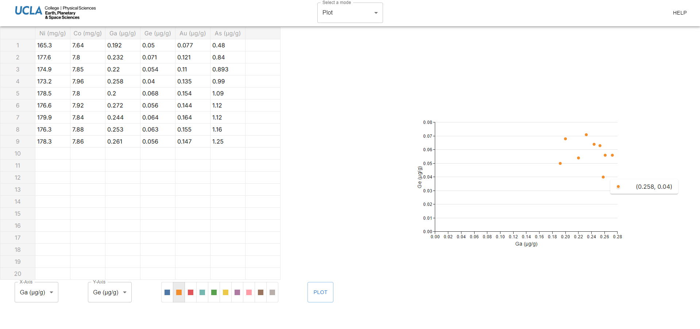

# Iron Meteorite Online Tool 

An all-in-one tool for classifying and plotting iron meteorite data, designed for researchers and students.

 <a href="https://meteorite-web-app.vercel.app/"><strong>View Demo »</strong></a>

## 💡 About This Tool

The motivation behind this project was to leverage UCLA's existing iron meteorite database to provide insights to the academic community. Our team's objectives included enabling efficient preliminary classification of iron meteorite samples as well as convenient visualization of data that could be compared to the existing database.

This tool requires users to have data pertaining to the content of specific elements of an iron meteorite sample. Note that this tool accepts input in specific units of measurements.

## ✨ Features

### Classify

This tool classifies iron meteorite samples into one of 11 distinct classes based on their Nickel, Cobalt, Gallium, and Germanium content. Users can perform multiple classifications simultaneously for enhanced efficiency.

  

### Plot

Additionally, this tool can plot the sample data of six elements against one another. Users can manually input their data into the spreadsheet interface or paste data from other spreadsheet applications. When plotted, users can examine specific points by hovering over them. The plot is customizable, allowing users to modify the plot color, as well as x-axis and y-axis options to suit their needs.

  

